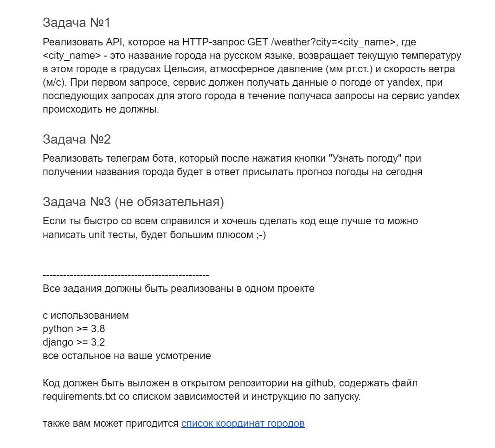

# Тестовое задание в TL GROUP

**Запуск**:

- `git clone https://github.com/MaximGudkov/portal.git` - клонирование репозитория
- `python -m venv venv` - создание виртуального окружения
- `venv/Scripts/activate` - активация виртуального окружения
-  НА linux: `source venv/bin/activate`
- переименование .env.sample в .env
- `pip install -r requirements.txt` - скачивание зависимостей
- `python manage.py makemigrations` - создание миграций
- `python manage.py migrate` - применение миграций
- `python manage.py runserver` - запуск django
- `python manage.py run_weather_bot` - запуск бота
